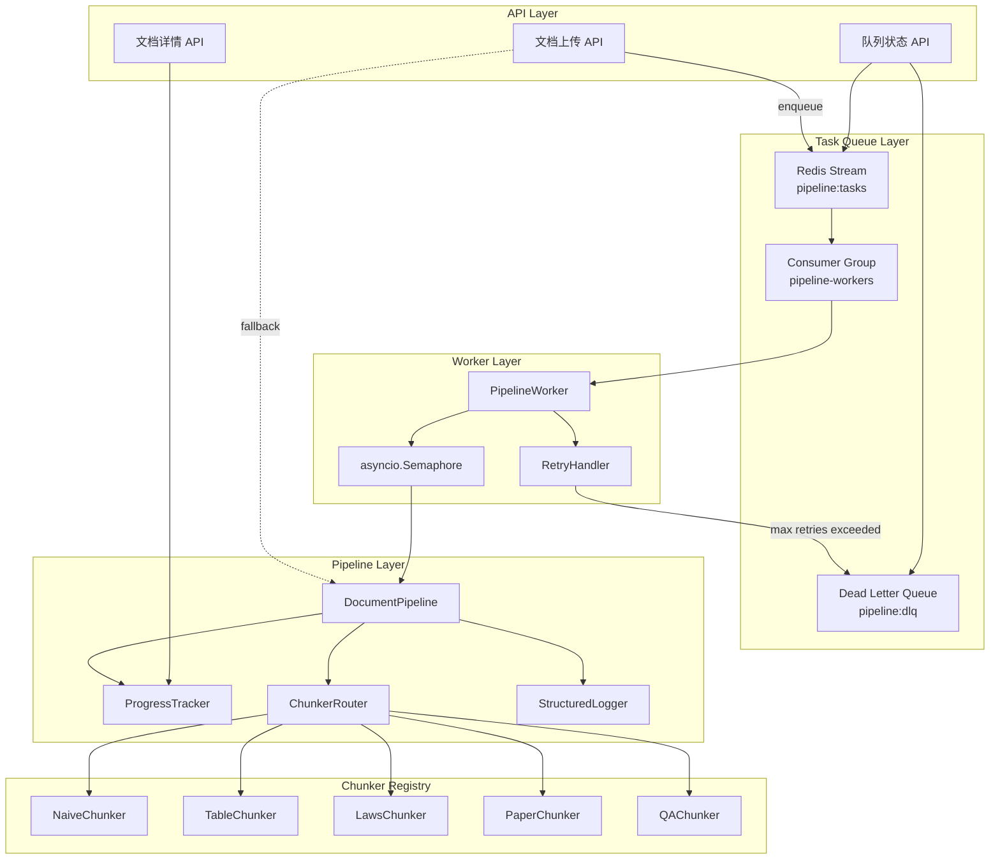

# 技术设计文档：Pipeline 生产级优化

## Overview

本设计将 Aladdin RAG 系统的文档处理管道从当前基于 `asyncio.create_task` 的临时方案升级为生产级任务处理系统。核心改造包括五个方面：

1. **持久化任务队列**：基于 Redis Stream + Consumer Group 实现任务持久化、自动恢复、重试与死信处理
2. **进度实时追踪**：各阶段加权进度更新，前端可轮询获取百分比和阶段描述
3. **多 Chunker 策略路由**：根据文件类型和内容特征自动选择最优切分策略，支持手动覆盖
4. **并发控制**：通过 Semaphore 限制同时处理的文件数，防止资源耗尽
5. **可观测性**：结构化 JSON 日志 + trace_id 链路追踪 + 慢阶段告警

设计原则：
- **渐进式升级**：Redis 不可用时自动降级为原有模式，不影响基本功能
- **最小侵入**：复用现有 `DocumentPipeline` 类，通过组合而非继承扩展能力
- **可扩展**：Chunker 通过工厂模式注册，新增策略无需修改路由逻辑

## Architecture



### 关键设计决策

| 决策 | 选择 | 理由 |
|------|------|------|
| 任务队列 | Redis Stream | 项目已依赖 Redis（未来缓存），Stream 原生支持 consumer group、ACK、pending 恢复，无需引入 Celery/RQ 等重量级依赖 |
| 降级策略 | 自动 fallback 到 asyncio.create_task | 保证单机开发环境无 Redis 也能正常工作 |
| 进度存储 | 直接写 Document 表 | 避免引入额外的 Redis key 管理，前端已有轮询 Document 详情的逻辑 |
| Chunker 路由 | 规则优先级 + 手动覆盖 | 规则简单可解释，手动覆盖满足特殊场景 |
| 日志格式 | JSON 结构化 + Python logging | 兼容现有日志基础设施，便于 ELK/Loki 等日志系统采集 |

## Components and Interfaces

### 1. TaskQueue（任务队列模块）

```python
# backend/app/pipeline/queue.py

class TaskMessage:
    """任务消息结构"""
    doc_id: str
    kb_id: str
    file_path: str
    retry_count: int = 0
    created_at: float  # timestamp
    trace_id: str  # UUID4

class TaskQueue:
    """Redis Stream 任务队列"""

    def __init__(self, redis_url: str, stream_key: str = "pipeline:tasks",
                 dlq_key: str = "pipeline:dlq", group_name: str = "pipeline-workers"):
        ...

    async def enqueue(self, msg: TaskMessage) -> str:
        """写入任务到 Stream，返回 message_id"""
        ...

    async def consume(self, consumer_name: str, count: int = 1,
                      block_ms: int = 5000) -> list[tuple[str, TaskMessage]]:
        """消费消息，返回 [(message_id, TaskMessage), ...]"""
        ...

    async def ack(self, message_id: str) -> None:
        """确认消息处理完成"""
        ...

    async def move_to_dlq(self, message_id: str, msg: TaskMessage, error: str) -> None:
        """将失败任务移入死信队列"""
        ...

    async def claim_pending(self, consumer_name: str, min_idle_ms: int = 60000) -> list[tuple[str, TaskMessage]]:
        """认领超时的 pending 消息（用于启动恢复）"""
        ...

    async def get_stats(self) -> QueueStats:
        """获取队列统计信息"""
        ...

    @classmethod
    async def create(cls, redis_url: str) -> "TaskQueue | None":
        """工厂方法，Redis 不可用时返回 None"""
        ...
```

### 2. PipelineWorker（工作进程）

```python
# backend/app/pipeline/worker.py

class PipelineWorker:
    """管道工作进程，消费 Redis Stream 任务"""

    def __init__(self, queue: TaskQueue, pipeline: DocumentPipeline,
                 max_concurrent: int = 3, max_retries: int = 3):
        self.semaphore = asyncio.Semaphore(max_concurrent)
        ...

    async def start(self) -> None:
        """启动 Worker 循环：claim pending → consume new"""
        ...

    async def _process_task(self, message_id: str, msg: TaskMessage) -> None:
        """处理单个任务：检查状态 → acquire semaphore → 执行 pipeline → ACK/retry"""
        ...

    async def _handle_failure(self, message_id: str, msg: TaskMessage, error: Exception) -> None:
        """失败处理：retry_count < max → 重新入队（指数退避）；否则 → DLQ"""
        ...
```

### 3. ProgressTracker（进度追踪器）

```python
# backend/app/pipeline/progress.py

class PipelineStage(Enum):
    LOAD = "load"       # 权重 10%
    OCR = "ocr"         # 权重 20%
    CHUNK = "chunk"     # 权重 20%
    EMBED = "embed"     # 权重 40%
    INDEX = "index"     # 权重 10%

STAGE_WEIGHTS = {
    PipelineStage.LOAD: (0, 10),    # 0% - 10%
    PipelineStage.OCR: (10, 30),    # 10% - 30%
    PipelineStage.CHUNK: (30, 50),  # 30% - 50%
    PipelineStage.EMBED: (50, 90),  # 50% - 90%
    PipelineStage.INDEX: (90, 100), # 90% - 100%
}

class ProgressTracker:
    """文档处理进度追踪器"""

    def __init__(self, doc_id: str, db_session_factory):
        ...

    async def start_stage(self, stage: PipelineStage, message: str = "") -> None:
        """标记阶段开始"""
        ...

    async def complete_stage(self, stage: PipelineStage) -> None:
        """标记阶段完成，更新进度到阶段终点"""
        ...

    async def skip_stage(self, stage: PipelineStage) -> None:
        """跳过阶段，直接累加该阶段权重"""
        ...

    async def update_sub_progress(self, stage: PipelineStage,
                                   completed: int, total: int, message: str = "") -> None:
        """阶段内子进度更新（如 embed 的 batch 进度）"""
        ...

    async def fail(self, stage: PipelineStage, error_message: str) -> None:
        """标记失败，progress 保持不变"""
        ...

    async def complete(self) -> None:
        """标记处理完成，progress=100"""
        ...

    @staticmethod
    def interpolate(stage: PipelineStage, completed: int, total: int) -> int:
        """计算阶段内线性插值进度"""
        start, end = STAGE_WEIGHTS[stage]
        if total <= 0:
            return end
        return start + int((completed / total) * (end - start))
```

### 4. ChunkerRouter（切分策略路由）

```python
# backend/app/pipeline/chunker_router.py

from abc import ABC, abstractmethod

class BaseChunker(ABC):
    """切分器抽象基类"""

    @abstractmethod
    def chunk(self, text: str, metadata: dict | None = None) -> ChunkResult:
        ...

class ChunkerFactory:
    """Chunker 工厂，管理注册和实例化"""
    REGISTRY: dict[str, type[BaseChunker]] = {}

    @classmethod
    def register(cls, name: str, chunker_cls: type[BaseChunker]) -> None:
        cls.REGISTRY[name] = chunker_cls

    @classmethod
    def create(cls, name: str, **kwargs) -> BaseChunker:
        if name not in cls.REGISTRY:
            raise ValueError(f"Unknown chunker type: {name}")
        return cls.REGISTRY[name](**kwargs)

class ChunkerRouter:
    """根据文件类型和内容特征选择 Chunker"""

    # 法律关键词正则
    _LAW_PATTERN = re.compile(r'本院认为|判决如下|第[一二三四五六七八九十\d]+条')

    # QA 配对正则
    _QA_PATTERN = re.compile(r'(?:Q:|A:|问:|答:)')

    @classmethod
    def select(cls, file_type: str, content: str) -> str:
        """返回 chunker 类型名称"""
        # 优先级 1：表格文件
        if file_type in ("csv", "xlsx"):
            return "table"
        # 优先级 2：法律文书
        if len(cls._LAW_PATTERN.findall(content)) >= 3:
            return "laws"
        # 优先级 3：学术论文
        if "Abstract" in content and ("References" in content or "Bibliography" in content):
            return "paper"
        # 优先级 4：QA 格式
        if len(cls._QA_PATTERN.findall(content)) >= 10:  # 5 对 = 10 次匹配
            return "qa"
        # 默认
        return "naive"
```

### 5. StructuredLogger（结构化日志）

```python
# backend/app/pipeline/logging.py

class PipelineLogger:
    """管道结构化日志器"""

    def __init__(self, trace_id: str, doc_id: str, slow_threshold_ms: int = 30000):
        self.trace_id = trace_id
        self.doc_id = doc_id
        self.slow_threshold_ms = slow_threshold_ms
        self._stage_timings: dict[str, int] = {}

    def stage_complete(self, stage: str, duration_ms: int,
                       input_size: int, output_size: int, **extra) -> None:
        """输出阶段完成日志"""
        ...

    def summary(self, total_duration_ms: int) -> None:
        """输出处理汇总日志"""
        ...
```

## Data Models

### Document 表扩展

```python
# 新增字段（Alembic migration）
class Document(Base):
    # ... 现有字段 ...
    progress: Mapped[int] = mapped_column(Integer, default=0)           # 0-100
    progress_message: Mapped[Optional[str]] = mapped_column(String, nullable=True)  # 阶段描述
```

### TaskMessage 结构（Redis Stream 消息体）

```json
{
  "doc_id": "uuid-string",
  "kb_id": "uuid-string",
  "file_path": "data/uploads/xxx.pdf",
  "retry_count": 0,
  "created_at": 1700000000.123,
  "trace_id": "uuid4-string"
}
```

### QueueStats 响应结构

```python
class QueueStats(BaseModel):
    stream_length: int       # Stream 总消息数
    pending_count: int       # 未 ACK 的消息数
    active_workers: int      # 活跃 consumer 数
    dlq_length: int          # 死信队列长度
```

### ChunkResult 结构（保持不变）

```python
@dataclass
class ChunkResult:
    parent_chunks: list[str]
    child_chunks: list[str]
    parent_child_map: dict[int, list[int]]  # parent_idx -> [child_idx, ...]
```

### 配置扩展

```python
class Settings(BaseSettings):
    # ... 现有配置 ...

    # Redis
    redis_url: str = "redis://localhost:6379/0"

    # Pipeline Worker
    pipeline_max_concurrent: int = 3
    pipeline_max_retries: int = 3
    pipeline_slow_threshold_ms: int = 30000
```

## Correctness Properties

*A property is a characteristic or behavior that should hold true across all valid executions of a system—essentially, a formal statement about what the system should do. Properties serve as the bridge between human-readable specifications and machine-verifiable correctness guarantees.*

### Property 1: 任务入队保留所有元数据

*For any* 有效的文档上传参数（doc_id, kb_id, file_path），调用 enqueue 后从 Redis Stream 读取的消息应包含完全相同的 doc_id、kb_id、file_path 字段值，且 trace_id 为有效 UUID4，retry_count 为 0。

**Validates: Requirements 1.1**

### Property 2: 重试计数与退避时间正确

*For any* 失败次数 N（1 ≤ N ≤ 3），重试后消息的 retry_count 应等于 N，且计算的退避延迟应等于 2^(N-1) 秒。

**Validates: Requirements 1.3**

### Property 3: 队列统计准确反映实际状态

*For any* 队列状态（N 条 pending 消息、M 条 DLQ 消息），调用 get_stats() 返回的 pending_count 应等于 N，dlq_length 应等于 M。

**Validates: Requirements 1.5**

### Property 4: 已完成文档被幂等跳过

*For any* 状态为 completed 的文档，当 Worker 消费到该文档的任务时，应直接 ACK 消息且不触发 Pipeline 处理逻辑。

**Validates: Requirements 1.7**

### Property 5: Embed 阶段进度线性插值正确

*For any* total_batches > 0 和 completed_batches（0 ≤ completed ≤ total），ProgressTracker.interpolate(EMBED, completed, total) 的返回值应等于 50 + int((completed / total) * 40)。

**Validates: Requirements 2.3**

### Property 6: 失败时进度值不变

*For any* 管道阶段和该阶段执行前的进度值 P，如果该阶段抛出异常，则异常处理后文档的 progress 字段应仍等于 P。

**Validates: Requirements 2.5**

### Property 7: 所有 Chunker 返回结构有效的 ChunkResult

*For any* 注册的 Chunker 实现和任意非空文本输入，chunk() 方法应返回 ChunkResult，其中：parent_child_map 的所有 key 为 parent_chunks 的有效索引，所有 value 中的元素为 child_chunks 的有效索引，且每个 child 索引在整个 map 中恰好出现一次。

**Validates: Requirements 3.1, 3.4**

### Property 8: Chunker 路由优先级正确

*For any* file_type 和 content 组合，ChunkerRouter.select 应返回满足最高优先级匹配规则的 chunker 类型：csv/xlsx → table，法律关键词 ≥ 3 → laws，Abstract + References → paper，QA 配对 ≥ 5 → qa，其他 → naive。

**Validates: Requirements 3.2**

### Property 9: 手动指定 chunker_type 覆盖自动路由

*For any* 有效的 chunker_type 配置值和任意文件内容，当知识库 config 中设置了 chunker_type 时，实际使用的 Chunker 类型应等于配置值，而非自动路由结果。

**Validates: Requirements 3.3**

### Property 10: 并发数不超过 Semaphore 上限

*For any* max_concurrent 值 N 和任意数量的并发任务提交，在任意时刻同时执行 Pipeline.process 的任务数应 ≤ N，且无论任务成功或失败，semaphore 都会被释放。

**Validates: Requirements 4.1, 4.2, 4.3**

### Property 11: Trace ID 在所有阶段日志中一致

*For any* 文档处理过程，所有输出的结构化日志条目中的 trace_id 字段值应相同，且为有效的 UUID4 格式。

**Validates: Requirements 5.1**

### Property 12: 阶段日志包含所有必需字段

*For any* 管道阶段（load/ocr/chunk/embed/index）的完成日志，输出的 JSON 应包含字段：trace_id、doc_id、stage、duration_ms、input_size、output_size、status，且所有字段值类型正确。

**Validates: Requirements 5.2**

### Property 13: 汇总日志各阶段耗时之和等于总耗时

*For any* 完成的文档处理，汇总日志中 stages 字典各值之和应等于 total_duration_ms（允许 ±10ms 误差）。

**Validates: Requirements 5.4**

### Property 14: 慢阶段检测阈值正确

*For any* 阶段耗时 D 和阈值 T，当 D > T 时日志级别应为 WARNING 且包含 `"slow": true`；当 D ≤ T 时日志级别应为 INFO 且不包含 slow 字段。

**Validates: Requirements 5.6**

## Error Handling

### 任务队列层

| 错误场景 | 处理策略 |
|----------|----------|
| Redis 连接失败（启动时） | 降级为 asyncio.create_task 模式，输出 WARNING 日志 |
| Redis 连接中断（运行时） | Worker 循环 catch 异常，等待 5s 后重连，期间不消费新任务 |
| 消息反序列化失败 | 直接 ACK 该消息（避免阻塞队列），记录 ERROR 日志 |
| 任务处理超时 | 通过 XCLAIM 的 min-idle-time 机制，其他 Worker 可认领超时任务 |

### Pipeline 层

| 错误场景 | 处理策略 |
|----------|----------|
| 文件不存在 | 标记 failed，不重试（文件丢失无法恢复） |
| OCR 服务不可用 | 重试（OCR 服务可能临时不可用） |
| Embedding 模型 OOM | 重试（可能是并发过高导致） |
| Milvus 写入失败 | 重试（网络抖动） |
| 数据库连接失败 | 重试（连接池耗尽可恢复） |

### 重试策略

```python
# 指数退避：1s, 2s, 4s
delay = 2 ** (retry_count - 1)  # retry_count 从 1 开始

# 不可重试的错误类型
NON_RETRYABLE_ERRORS = (
    FileNotFoundError,      # 文件不存在
    ValueError,             # 参数错误（如不支持的文件类型）
    PermissionError,        # 权限不足
)
```

### 进度追踪层

| 错误场景 | 处理策略 |
|----------|----------|
| 进度更新数据库失败 | 仅记录 WARNING 日志，不影响主流程（进度是辅助信息） |
| 进度值计算异常 | clamp 到 [0, 100] 范围，记录 WARNING |

## Testing Strategy

### 属性测试（Property-Based Testing）

使用 **Hypothesis** 库实现属性测试，每个属性测试运行最少 100 次迭代。

测试覆盖的属性：
- Property 1-14（见 Correctness Properties 章节）
- 每个测试用 `@settings(max_examples=100)` 配置
- 标签格式：`# Feature: pipeline-production-optimization, Property N: {description}`

### 单元测试

| 模块 | 测试重点 |
|------|----------|
| TaskQueue | enqueue/consume/ack 基本流程、DLQ 转移、stats 查询 |
| PipelineWorker | 启动恢复 pending、重试逻辑、降级模式 |
| ProgressTracker | 各阶段进度计算、skip 逻辑、失败保持 |
| ChunkerRouter | 各规则匹配、优先级顺序、边界条件（关键词恰好 3 次） |
| 各 Chunker | 特定文档类型的切分质量（法律文书条款识别、论文章节识别等） |
| PipelineLogger | JSON 格式正确性、slow 检测、summary 计算 |

### 集成测试

| 场景 | 验证点 |
|------|--------|
| 完整文档处理流程 | 上传 → 入队 → 消费 → 处理 → 完成，验证最终状态 |
| Redis 断连恢复 | 模拟 Redis 断连 → 降级 → Redis 恢复 → 重新消费 |
| 并发上传 | 同时上传 10 个文件，验证 max_concurrent 限制生效 |
| Worker 重启恢复 | 处理中杀掉 Worker → 重启 → 验证 pending 任务被恢复 |

### 测试工具

- **pytest** + **pytest-asyncio**：异步测试框架
- **hypothesis**：属性测试库
- **fakeredis**：Redis mock（单元测试中替代真实 Redis）
- **unittest.mock**：模拟外部依赖（Milvus、OCR 等）
