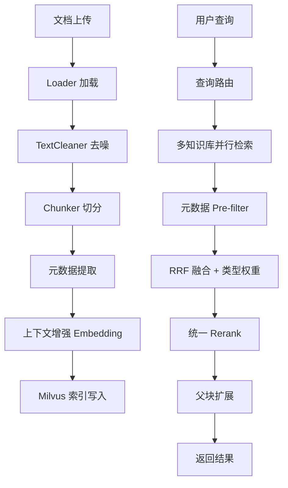
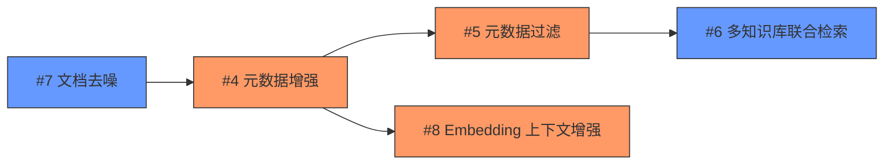
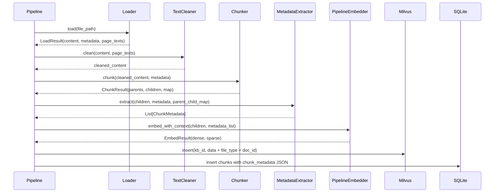
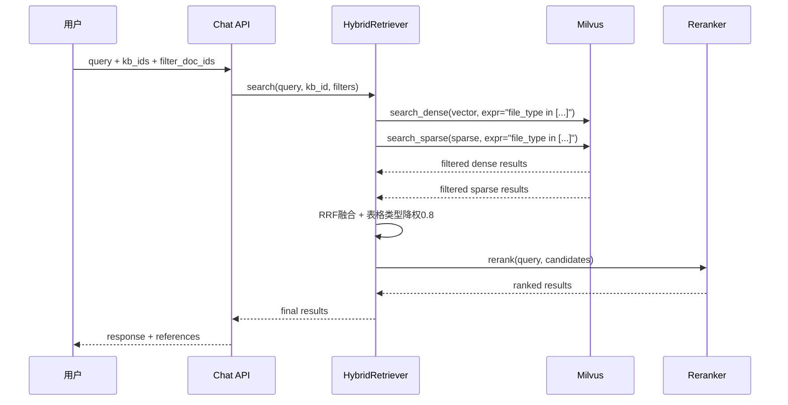
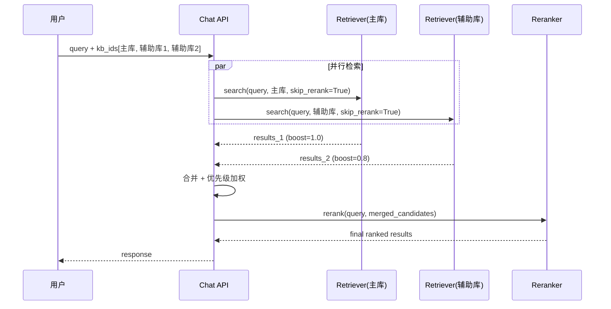

# 设计文档: RAG 检索质量优化

## Overview

本功能集合针对 Aladdin RAG 系统的检索质量进行系统性优化，涵盖五个核心模块：Chunk 元数据增强、元数据过滤检索、Embedding 上下文增强、文档预处理去噪、多知识库联合检索。

优化目标是在不引入额外 LLM 调用成本的前提下，通过结构化元数据提取、智能过滤、上下文拼接和噪音去除，显著提升检索准确率和召回率。设计遵循"用户零配置、系统自动提取"的原则，所有元数据增强对用户透明。

按优先级分为 P0（检索质量基础：#4、#5、#8）和 P1（准度提升：#7、#6）两个阶段实施。

## Architecture

### 整体数据流



### 模块依赖关系




## 时序图

### P0: 文档入库增强流程



### P0: 元数据过滤检索流程



### P1: 多知识库联合检索流程




## Components and Interfaces

### 组件 1: ChunkMetadata（元数据模型）

**职责**: 定义 chunk 级别的结构化元数据

```python
from dataclasses import dataclass, field
from typing import Optional

@dataclass
class ChunkMetadata:
    """Chunk 元数据，入库时自动提取"""
    filename: str                           # 来源文件名
    file_type: str                          # 文件类型 (pdf/docx/md/csv...)
    chunker_type: str                       # 使用的切分器类型
    chunk_index: int                        # chunk 在文档中的序号
    page_num: Optional[int] = None          # PDF 页码（从1开始）
    section_path: list[str] = field(default_factory=list)  # 章节标题路径
    element_type: str = "text"              # 元素类型: text/table/title
```

### 组件 2: MetadataExtractor（元数据提取器）

**职责**: 从 chunker 输出中自动提取结构化元数据

```python
class MetadataExtractor:
    """元数据提取器 - 从切分结果中提取结构化信息"""

    def extract(
        self,
        child_chunks: list[str],
        parent_chunks: list[str],
        parent_child_map: dict[int, list[int]],
        doc_metadata: dict,
        page_texts: list[str] | None = None,
    ) -> list[ChunkMetadata]:
        """为每个 child chunk 生成元数据"""
        ...

    def _detect_page_num(
        self, chunk_content: str, page_texts: list[str]
    ) -> int | None:
        """根据 chunk 内容在 page_texts 中定位页码"""
        ...

    def _extract_section_path(
        self, chunk_content: str, full_text: str
    ) -> list[str]:
        """提取 chunk 所属的章节标题路径"""
        ...
```


### 组件 3: TextCleaner（文档去噪器）

**职责**: 在 chunk 之前去除页眉页脚、页码等噪音文本

```python
class TextCleaner:
    """文档文本去噪器"""

    # 页面顶部/底部区域比例阈值
    HEADER_FOOTER_RATIO = 0.05
    # 跨页重复判定频率阈值
    REPEAT_FREQUENCY_THRESHOLD = 0.5

    def clean(
        self,
        content: str,
        page_texts: list[str] | None = None,
        page_blocks: list[list[dict]] | None = None,
    ) -> str:
        """执行去噪流程: bbox过滤 → 重复检测 → 正则清理"""
        ...

    def _filter_by_bbox(
        self, page_blocks: list[list[dict]], page_height: float
    ) -> list[list[dict]]:
        """过滤页面顶部/底部5%区域的短文本块"""
        ...

    def _detect_repeated_headers(
        self, page_texts: list[str]
    ) -> set[str]:
        """检测跨页重复短文本（出现频率>50%判定为页眉页脚）"""
        ...

    def _remove_page_numbers(self, text: str) -> str:
        """正则去除纯页码行"""
        ...
```

### 组件 4: ContextualEmbedder（上下文增强嵌入）

**职责**: 在 embedding 时为 child chunk 拼接上下文前缀

```python
class ContextualEmbedder:
    """上下文增强的 embedding 构造器"""

    PARENT_CONTEXT_CHARS = 150  # 父块上下文截取字符数

    def build_embed_text(
        self,
        child_chunk: str,
        metadata: ChunkMetadata,
        parent_chunk: str | None = None,
    ) -> str:
        """构造增强后的 embedding 输入文本

        格式: [文件名 | 章节路径]\n{parent[:150]}\n{child_chunk}
        """
        ...
```


### 组件 5: 增强的 MilvusClient

**职责**: 扩展 Milvus schema 支持 scalar 过滤字段，search 支持 expr 参数

```python
# 扩展后的 Milvus schema 字段
_FIELDS = [
    FieldSchema(name="chunk_id", dtype=DataType.VARCHAR, is_primary=True, max_length=64),
    FieldSchema(name="doc_id", dtype=DataType.VARCHAR, max_length=64),
    FieldSchema(name="content", dtype=DataType.VARCHAR, max_length=65535),
    FieldSchema(name="dense_vector", dtype=DataType.FLOAT_VECTOR, dim=1024),
    FieldSchema(name="sparse_vector", dtype=DataType.SPARSE_FLOAT_VECTOR),
    FieldSchema(name="parent_id", dtype=DataType.VARCHAR, max_length=64),
    FieldSchema(name="chunk_index", dtype=DataType.INT64),
    # 新增 scalar 字段
    FieldSchema(name="file_type", dtype=DataType.VARCHAR, max_length=20),
    FieldSchema(name="element_type", dtype=DataType.VARCHAR, max_length=20),
]

class MilvusClient:
    async def search_dense(
        self, kb_id: str, vector: list[float], top_k: int = 10,
        expr: str | None = None,  # 新增: pre-filter 表达式
    ) -> list[dict[str, Any]]:
        ...

    async def search_sparse(
        self, kb_id: str, sparse_vector: dict[int, float], top_k: int = 10,
        expr: str | None = None,  # 新增: pre-filter 表达式
    ) -> list[dict[str, Any]]:
        ...
```

### 组件 6: 增强的 HybridRetriever

**职责**: 支持元数据过滤、表格类型降权、多知识库联合检索

```python
@dataclass
class RetrievalFilter:
    """检索过滤条件"""
    doc_ids: list[str] | None = None       # 限定文档范围
    file_types: list[str] | None = None    # 限定文件类型
    
    def to_milvus_expr(self) -> str | None:
        """转换为 Milvus filter 表达式"""
        parts = []
        if self.doc_ids:
            ids_str = ", ".join(f'"{d}"' for d in self.doc_ids)
            parts.append(f"doc_id in [{ids_str}]")
        if self.file_types:
            types_str = ", ".join(f'"{t}"' for t in self.file_types)
            parts.append(f"file_type in [{types_str}]")
        return " and ".join(parts) if parts else None
```


### 组件 7: 多知识库检索编排

**职责**: 并行检索多个知识库，加权合并后统一 Rerank

```python
@dataclass
class KBRetrievalConfig:
    """知识库检索配置"""
    kb_id: str
    priority: float = 1.0  # 优先级权重 (主库1.0, 辅助库0.8)

class MultiKBRetriever:
    """多知识库联合检索器"""

    def __init__(
        self,
        hybrid_retriever: HybridRetriever,
        max_concurrency: int = 5,
    ):
        self.retriever = hybrid_retriever
        self.max_concurrency = max_concurrency

    async def search(
        self, query: str,
        kb_configs: list[KBRetrievalConfig],
        top_k: int = 10,
        filters: RetrievalFilter | None = None,
    ) -> list[RetrievalResult]:
        """并行检索多个知识库，加权合并后统一 Rerank"""
        ...

    def _weighted_merge(
        self,
        results_by_kb: dict[str, list[RetrievalResult]],
        kb_configs: list[KBRetrievalConfig],
    ) -> list[RetrievalResult]:
        """按知识库优先级加权合并 RRF 分数"""
        ...
```

## Data Models

### Milvus Collection Schema（扩展后）

| 字段名 | 类型 | 说明 | 索引 |
|--------|------|------|------|
| chunk_id | VARCHAR(64) | 主键 | Primary |
| doc_id | VARCHAR(64) | 文档ID | Scalar |
| content | VARCHAR(65535) | chunk文本 | - |
| dense_vector | FLOAT_VECTOR(1024) | 稠密向量 | HNSW |
| sparse_vector | SPARSE_FLOAT_VECTOR | 稀疏向量 | SPARSE_INVERTED |
| parent_id | VARCHAR(64) | 父块ID | - |
| chunk_index | INT64 | chunk序号 | - |
| **file_type** | **VARCHAR(20)** | **文件类型(新增)** | **Scalar** |
| **element_type** | **VARCHAR(20)** | **元素类型(新增)** | **Scalar** |

### SQLite Chunk 表 chunk_metadata JSON 结构

```python
{
    "filename": "合同.pdf",
    "file_type": "pdf",
    "chunker_type": "hierarchical",
    "chunk_index": 5,
    "page_num": 3,                    # PDF 专有
    "section_path": ["第三章", "合同条款"],  # 结构化文档
    "element_type": "text"            # text/table/title
}
```


### ChatCompletionRequest 扩展

```python
class ChatCompletionRequest(BaseModel):
    # 现有字段...
    knowledge_base_id: str | None = None
    # 新增字段
    kb_ids: list[str] | None = None        # 多知识库联合检索
    filter_doc_ids: list[str] | None = None  # 限定文档范围过滤
```

## 算法伪代码

### 算法 1: 元数据提取流程

```python
def extract_metadata(
    child_chunks: list[str],
    parent_chunks: list[str],
    parent_child_map: dict[int, list[int]],
    doc_metadata: dict,
    page_texts: list[str] | None,
) -> list[ChunkMetadata]:
    """
    前置条件:
    - child_chunks 非空
    - doc_metadata 包含 filename 和 file_type
    - parent_child_map 覆盖所有 child_chunks 索引
    
    后置条件:
    - 返回列表长度 == len(child_chunks)
    - 每个 ChunkMetadata 的 filename 和 file_type 非空
    - PDF 类型文档的 page_num 在有效范围内 [1, page_count]
    """
    filename = doc_metadata["filename"]
    file_type = doc_metadata["file_type"]
    chunker_type = doc_metadata.get("chunker_type", "hierarchical")
    
    metadata_list = []
    for child_idx, child_text in enumerate(child_chunks):
        # 定位页码（仅 PDF）
        page_num = None
        if file_type == "pdf" and page_texts:
            page_num = _detect_page_num(child_text, page_texts)
        
        # 提取章节路径
        section_path = _extract_section_path(child_text, parent_chunks, parent_child_map, child_idx)
        
        # 判断元素类型
        element_type = _detect_element_type(child_text)
        
        metadata_list.append(ChunkMetadata(
            filename=filename,
            file_type=file_type,
            chunker_type=chunker_type,
            chunk_index=child_idx,
            page_num=page_num,
            section_path=section_path,
            element_type=element_type,
        ))
    
    return metadata_list
```

### 算法 2: PDF 页码定位

```python
def _detect_page_num(chunk_content: str, page_texts: list[str]) -> int | None:
    """
    前置条件:
    - chunk_content 非空
    - page_texts 为按页顺序的文本列表
    
    后置条件:
    - 返回 None 或 [1, len(page_texts)] 范围内的整数
    - 返回的页码对应的 page_text 包含 chunk_content 的前50字符
    
    循环不变量:
    - 遍历过程中 best_page 始终是当前最佳匹配页
    """
    # 取 chunk 前50字符作为定位锚点
    anchor = chunk_content[:50].strip()
    if not anchor:
        return None
    
    best_page = None
    best_pos = float('inf')
    
    for page_idx, page_text in enumerate(page_texts):
        pos = page_text.find(anchor)
        if pos != -1 and pos < best_pos:
            best_pos = pos
            best_page = page_idx + 1  # 页码从1开始
    
    return best_page
```


### 算法 3: 跨页重复文本检测（去噪）

```python
def _detect_repeated_headers(page_texts: list[str]) -> set[str]:
    """
    前置条件:
    - page_texts 至少包含2页
    
    后置条件:
    - 返回的字符串集合中每个元素出现频率 > 50%
    - 返回的字符串长度均 < 50 字符（短文本）
    
    循环不变量:
    - counter 中每个 key 的 count <= 已遍历的页数
    """
    if len(page_texts) < 2:
        return set()
    
    total_pages = len(page_texts)
    # 提取每页首尾各3行的短文本
    candidates: dict[str, int] = {}
    
    for page_text in page_texts:
        lines = page_text.strip().split('\n')
        # 取首3行和尾3行
        check_lines = lines[:3] + lines[-3:]
        for line in check_lines:
            text = line.strip()
            if 2 < len(text) < 50:  # 短文本才可能是页眉页脚
                candidates[text] = candidates.get(text, 0) + 1
    
    # 出现频率 > 50% 判定为页眉页脚
    threshold = total_pages * REPEAT_FREQUENCY_THRESHOLD
    return {text for text, count in candidates.items() if count > threshold}


def _filter_by_bbox(
    page_blocks: list[dict], page_height: float
) -> list[dict]:
    """
    前置条件:
    - page_blocks 中每个 block 包含 bbox (x0, y0, x1, y1)
    - page_height > 0
    
    后置条件:
    - 返回的 blocks 不包含顶部5%和底部5%区域的短文本
    - 长文本（>100字符）即使在边缘区域也保留
    """
    header_threshold = page_height * 0.05
    footer_threshold = page_height * 0.95
    
    filtered = []
    for block in page_blocks:
        y0 = block["bbox"][1]
        y1 = block["bbox"][3]
        text = block.get("text", "")
        
        # 顶部/底部5%区域的短文本过滤
        is_edge = y0 < header_threshold or y1 > footer_threshold
        is_short = len(text.strip()) < 100
        
        if is_edge and is_short:
            continue  # 跳过边缘短文本（疑似页眉页脚）
        filtered.append(block)
    
    return filtered
```

### 算法 4: Embedding 上下文增强构造

```python
def build_embed_text(
    child_chunk: str,
    metadata: ChunkMetadata,
    parent_chunk: str | None = None,
) -> str:
    """
    前置条件:
    - child_chunk 非空
    - metadata.filename 非空
    
    后置条件:
    - 返回文本以 metadata 前缀开头
    - 返回文本包含完整的 child_chunk
    - 父块上下文截取不超过 150 字符
    - 返回文本总长度 <= child_chunk长度 + 前缀长度 + 150 + 分隔符
    """
    # 构造标题路径前缀
    parts = [metadata.filename]
    if metadata.section_path:
        parts.extend(metadata.section_path)
    prefix = " | ".join(parts)
    
    # 构造最终 embedding 文本
    segments = [f"[{prefix}]"]
    
    if parent_chunk:
        parent_context = parent_chunk[:150].strip()
        if parent_context and parent_context != child_chunk[:150]:
            segments.append(parent_context)
    
    segments.append(child_chunk)
    
    return "\n".join(segments)
```


### 算法 5: RRF 融合 + 表格类型降权

```python
def _rrf_fusion_with_type_weight(
    results_lists: list[list[RetrievalResult]],
    k: int = 60,
    type_weights: dict[str, float] | None = None,
) -> list[RetrievalResult]:
    """
    前置条件:
    - results_lists 非空，每个子列表按相关性降序排列
    - k > 0
    - type_weights 中的值在 (0, 1.5] 范围内
    
    后置条件:
    - 返回列表按融合分数降序排列
    - 表格类 chunk 的分数被乘以 type_weights["table"] (默认0.8)
    - 不丢失任何输入中的 chunk（去重后）
    
    循环不变量:
    - scores 字典中每个 chunk_id 的分数为所有列表中 RRF 贡献之和
    """
    if type_weights is None:
        type_weights = {"table": 0.8}
    
    scores: dict[str, float] = {}
    items: dict[str, RetrievalResult] = {}
    
    for results in results_lists:
        for rank, item in enumerate(results):
            rrf_score = 1.0 / (k + rank + 1)
            scores[item.chunk_id] = scores.get(item.chunk_id, 0) + rrf_score
            items[item.chunk_id] = item
    
    # 施加类型权重
    for chunk_id, item in items.items():
        element_type = item.metadata.get("element_type", "text")
        weight = type_weights.get(element_type, 1.0)
        scores[chunk_id] *= weight
    
    # 按分数降序排列
    sorted_ids = sorted(scores.keys(), key=lambda x: scores[x], reverse=True)
    return [items[cid] for cid in sorted_ids]
```

### 算法 6: 多知识库并行检索 + 加权合并

```python
async def multi_kb_search(
    query: str,
    kb_configs: list[KBRetrievalConfig],
    retriever: HybridRetriever,
    top_k: int = 10,
    filters: RetrievalFilter | None = None,
) -> list[RetrievalResult]:
    """
    前置条件:
    - kb_configs 非空，至少包含一个知识库
    - 所有知识库使用相同的 embedding 模型
    - kb_configs[0] 为主库 (priority=1.0)
    
    后置条件:
    - 返回结果数量 <= top_k
    - 主库结果在同等 rerank 分数下排序靠前
    - 结果已经过统一 Rerank
    """
    expr = filters.to_milvus_expr() if filters else None
    
    # 并行检索所有知识库（skip_rerank=True，合并后统一 rerank）
    tasks = [
        retriever.search(query, cfg.kb_id, top_k=top_k * 3, skip_rerank=True, expr=expr)
        for cfg in kb_configs
    ]
    results_by_kb = await asyncio.gather(*tasks)
    
    # 加权合并：按知识库优先级调整 RRF 分数
    merged: dict[str, RetrievalResult] = {}
    merged_scores: dict[str, float] = {}
    
    for cfg, results in zip(kb_configs, results_by_kb):
        for item in results:
            key = item.chunk_id
            boosted_score = item.score * cfg.priority
            if key not in merged or boosted_score > merged_scores[key]:
                merged[key] = item
                merged_scores[key] = boosted_score
    
    # 按加权分数排序
    sorted_items = sorted(merged.values(), key=lambda x: merged_scores[x.chunk_id], reverse=True)
    
    # 统一 Rerank
    return await retriever.rerank_and_expand(query, sorted_items, top_k)
```


### 算法 7: 页码正则去除

```python
import re

# 页码正则模式
_PAGE_NUMBER_PATTERNS = [
    r'^\s*-\s*\d+\s*-\s*$',           # - 3 -
    r'^\s*第\s*\d+\s*页\s*$',          # 第 3 页
    r'^\s*Page\s+\d+\s*(of\s+\d+)?\s*$',  # Page 3 of 10
    r'^\s*\d+\s*/\s*\d+\s*$',          # 3/10
    r'^\s*\d{1,4}\s*$',                # 纯数字（1-4位）
]
_PAGE_NUM_RE = re.compile('|'.join(f'(?:{p})' for p in _PAGE_NUMBER_PATTERNS), re.MULTILINE | re.IGNORECASE)

def _remove_page_numbers(text: str) -> str:
    """
    前置条件:
    - text 为多行文本
    
    后置条件:
    - 返回文本不包含匹配页码模式的独立行
    - 非页码行内容保持不变
    - 不会误删包含其他内容的行
    """
    lines = text.split('\n')
    cleaned = [line for line in lines if not _PAGE_NUM_RE.match(line)]
    return '\n'.join(cleaned)
```

## 关键函数形式化规格

### build_embed_text()

```python
def build_embed_text(child_chunk: str, metadata: ChunkMetadata, parent_chunk: str | None) -> str:
    ...
```

**前置条件:**
- `child_chunk` 非空且已 strip
- `metadata.filename` 非空字符串
- `metadata.file_type` 为合法文件类型

**后置条件:**
- 返回值包含完整的 `child_chunk` 内容
- 返回值以 `[` 开头（metadata 前缀）
- 若 `parent_chunk` 非空，返回值包含其前 150 字符
- 返回值长度 > len(child_chunk)

**循环不变量:** N/A

### _detect_repeated_headers()

```python
def _detect_repeated_headers(page_texts: list[str]) -> set[str]:
    ...
```

**前置条件:**
- `page_texts` 长度 >= 2

**后置条件:**
- 返回集合中每个字符串在 page_texts 中出现频率 > 50%
- 返回集合中每个字符串长度 < 50
- 返回集合为 page_texts 中实际存在的文本子集

**循环不变量:**
- 遍历过程中 `candidates[text]` <= 已遍历页数

### multi_kb_search()

```python
async def multi_kb_search(query, kb_configs, retriever, top_k, filters) -> list[RetrievalResult]:
    ...
```

**前置条件:**
- `kb_configs` 非空
- `query` 非空字符串
- `top_k` > 0

**后置条件:**
- 返回列表长度 <= top_k
- 返回列表按 rerank 分数降序排列
- 主库（priority=1.0）结果在同分时优先

**循环不变量:**
- 并行检索过程中各知识库独立，无共享状态


## 示例用法

### 示例 1: 文档入库（元数据增强 + 上下文 Embedding）

```python
# pipeline.py 中的 Index 阶段改造
from app.pipeline.metadata import MetadataExtractor, ChunkMetadata
from app.pipeline.context_embedder import ContextualEmbedder

# 提取元数据
extractor = MetadataExtractor()
metadata_list = extractor.extract(
    child_chunks=enriched_children,
    parent_chunks=chunk_result.parent_chunks,
    parent_child_map=chunk_result.parent_child_map,
    doc_metadata=load_result.metadata,
    page_texts=load_result.page_texts,
)

# 构造上下文增强的 embedding 输入
ctx_embedder = ContextualEmbedder()
embed_texts = []
for child_idx, (child_text, meta) in enumerate(zip(enriched_children, metadata_list)):
    parent_idx = self._find_parent(chunk_result.parent_child_map, child_idx)
    parent_text = chunk_result.parent_chunks[parent_idx] if parent_idx is not None else None
    embed_text = ctx_embedder.build_embed_text(child_text, meta, parent_text)
    embed_texts.append(embed_text)

# Embedding（使用增强后的文本）
embed_result = await self.embedder.embed(embed_texts)

# 写入 Milvus（包含新增 scalar 字段）
milvus_data.append({
    "chunk_id": child_id,
    "doc_id": doc_id,
    "content": child_text[:65535],  # 存原文，非增强文本
    "dense_vector": embed_result.dense_vectors[child_idx],
    "sparse_vector": embed_result.sparse_vectors[child_idx],
    "parent_id": parent_id or "",
    "chunk_index": child_idx,
    "file_type": meta.file_type,        # 新增
    "element_type": meta.element_type,   # 新增
})
```

### 示例 2: 元数据过滤检索

```python
# 只在指定文档中搜索
filter = RetrievalFilter(doc_ids=["doc-123", "doc-456"])
expr = filter.to_milvus_expr()
# 生成: 'doc_id in ["doc-123", "doc-456"]'

results = await hybrid_retriever.search(
    query="合同违约条款",
    kb_id="kb-001",
    top_k=10,
    expr=expr,
)
```

### 示例 3: 多知识库联合检索

```python
kb_configs = [
    KBRetrievalConfig(kb_id="kb-main", priority=1.0),    # 主库
    KBRetrievalConfig(kb_id="kb-legal", priority=0.8),   # 辅助库
    KBRetrievalConfig(kb_id="kb-policy", priority=0.7),  # 辅助库
]

results = await multi_kb_search(
    query="员工离职补偿标准",
    kb_configs=kb_configs,
    retriever=hybrid_retriever,
    top_k=10,
)
```

### 示例 4: 文档去噪

```python
from app.pipeline.cleaner import TextCleaner

cleaner = TextCleaner()

# 使用 pymupdf 获取带 bbox 的文本块
import fitz
doc = fitz.open("contract.pdf")
page_blocks = []
for page in doc:
    blocks = page.get_text("dict")["blocks"]
    page_blocks.append(blocks)

# 执行去噪
cleaned_content = cleaner.clean(
    content=raw_content,
    page_texts=page_texts,
    page_blocks=page_blocks,
)
```


## Correctness Properties

### Property 1: 元数据完整性

∀ chunk ∈ indexed_chunks: chunk.metadata.filename ≠ "" ∧ chunk.metadata.file_type ≠ ""

When 任何文档经过 pipeline 入库后, then 每个 chunk 的 metadata 中 filename 和 file_type 字段必须非空。

**Validates: Requirements 1.2**

### Property 2: 页码有效性

∀ chunk ∈ pdf_chunks: chunk.page_num = None ∨ (1 ≤ chunk.page_num ≤ doc.page_count)

When PDF 文档的 chunk 被提取页码时, then 页码值要么为 None（无法定位），要么在 [1, page_count] 范围内。

**Validates: Requirements 1.3**

### Property 3: Embedding 上下文一致性

∀ child ∈ children: embed_text(child).contains(child.content) ∧ embed_text(child).startswith("[")

When 构造上下文增强的 embedding 文本时, then 返回文本必须包含完整的原始 child chunk 内容，且以 metadata 前缀 "[" 开头。

**Validates: Requirements 3.1**

### Property 4: 过滤正确性

∀ result ∈ filtered_search(expr="doc_id in [X]"): result.doc_id ∈ [X]

When 使用 doc_id 过滤条件检索时, then 返回结果中每个 chunk 的 doc_id 必须在过滤列表中。

**Validates: Requirements 2.2**

### Property 5: 去噪保守性

∀ line ∈ removed_lines: len(line) < 100 ∧ (is_page_number(line) ∨ is_repeated_header(line))

When TextCleaner 去除文本行时, then 被去除的行必须同时满足短文本（<100字符）且匹配页码模式或跨页重复。

**Validates: Requirements 4.1**

### Property 6: RRF 降权一致性

∀ table_chunk ∈ rrf_results: table_chunk.score = base_rrf_score × 0.8

When 表格类 chunk 参与 RRF 融合时, then 其最终分数为基础 RRF 分数乘以 0.8 的降权系数。

**Validates: Requirements 2.4**

### Property 7: 多库合并完整性

∀ kb ∈ kb_configs: results_from(kb) ⊆ final_merged_results (去重前)

When 多知识库联合检索时, then 每个知识库的检索结果在去重前都应出现在合并结果中。

**Validates: Requirements 5.2**

### Property 8: 优先级排序

∀ r1, r2 ∈ results: r1.kb_priority > r2.kb_priority ∧ r1.rerank_score = r2.rerank_score → rank(r1) < rank(r2)

When 多库结果合并排序时, then 在 rerank 分数相同的情况下，高优先级知识库的结果排序靠前。

**Validates: Requirements 5.3**

## Error Handling

### 场景 1: Milvus Schema 迁移失败

**条件**: 已有 collection 无法添加新字段（Milvus 不支持 ALTER）
**响应**: 检测到旧 schema → 创建新 collection（带后缀 _v2）→ 后台迁移数据 → 切换别名
**恢复**: 保留旧 collection 直到迁移完成验证

### 场景 2: 元数据提取异常

**条件**: PDF 页码定位失败或章节路径提取异常
**响应**: 对应字段设为 None/空列表，不阻塞入库流程
**恢复**: 记录 warning 日志，chunk 正常入库但缺少部分元数据

### 场景 3: 多知识库部分检索失败

**条件**: 某个辅助知识库的 Milvus collection 不存在或检索超时
**响应**: 捕获异常，该库返回空结果，其他库结果正常合并
**恢复**: 日志记录失败库信息，最终结果标注 degraded=True

### 场景 4: 去噪误删正文

**条件**: 正文短句被误判为页眉页脚
**响应**: 保守策略 — 仅过滤同时满足"边缘位置 + 短文本 + 跨页重复"的内容
**恢复**: 提供 cleaner 开关，知识库 config 中可设置 `enable_cleaner: false` 跳过去噪

## Testing Strategy

### 单元测试

- `test_metadata_extractor.py`: 验证各文件类型的元数据提取正确性
- `test_text_cleaner.py`: 验证去噪不误删正文、正确识别页眉页脚
- `test_contextual_embedder.py`: 验证上下文拼接格式正确
- `test_retrieval_filter.py`: 验证 filter 表达式生成正确
- `test_multi_kb_retriever.py`: 验证加权合并逻辑

### Property-Based Testing

**测试库**: hypothesis

- 元数据提取：任意文本输入 → 输出列表长度恒等于输入长度
- 去噪保守性：任意长文本（>100字符）→ 不会被去噪删除
- RRF 降权：表格类 chunk 分数恒 ≤ 同位置文本类 chunk 分数
- 过滤表达式：任意 doc_ids 列表 → 生成合法 Milvus expr 字符串

### 集成测试

- 端到端入库测试：上传 PDF → 验证 Milvus 中 file_type/element_type 字段正确
- 过滤检索测试：插入多文档 → 按 doc_id 过滤 → 验证结果只包含目标文档
- 多库联合测试：创建多个知识库 → 联合检索 → 验证主库优先级生效


## 性能考量

- **Milvus Pre-filter**: scalar 字段过滤在索引层执行，不影响向量检索性能（Milvus 原生优化）
- **多库并行检索**: 使用 `asyncio.gather` 并行，总延迟 = max(各库延迟)，非累加
- **Embedding 上下文拼接**: 仅增加约 200 字符输入，对 BGE-M3 (8192 token) 无压力
- **去噪开销**: TextCleaner 为纯 CPU 正则+统计操作，单文档 < 10ms
- **Schema 迁移**: 新 collection 创建后需重新 embedding 已有文档（一次性成本）

## 安全考量

- 多知识库联合检索需验证用户对所有目标知识库的访问权限
- filter_doc_ids 参数需校验文档确实属于指定知识库，防止跨库数据泄露
- chunk_metadata JSON 不存储敏感信息（仅文件名、类型等结构信息）

## 依赖

- **pymilvus** >= 2.3.0（支持 scalar 字段 pre-filter）
- **pymupdf (fitz)** >= 1.23.0（get_text("dict") 获取 bbox）
- **hypothesis**（property-based testing）
- 现有依赖：FastAPI, SQLAlchemy, asyncio, re
