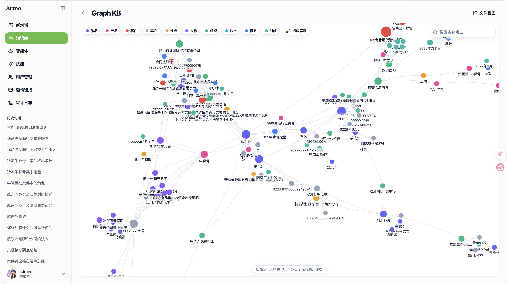
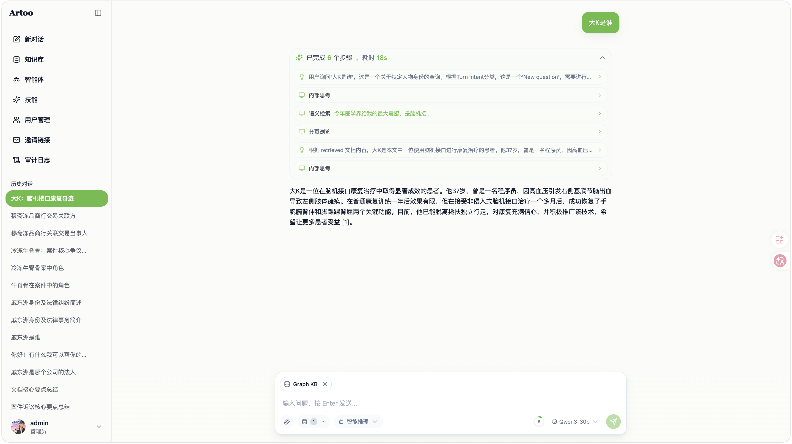
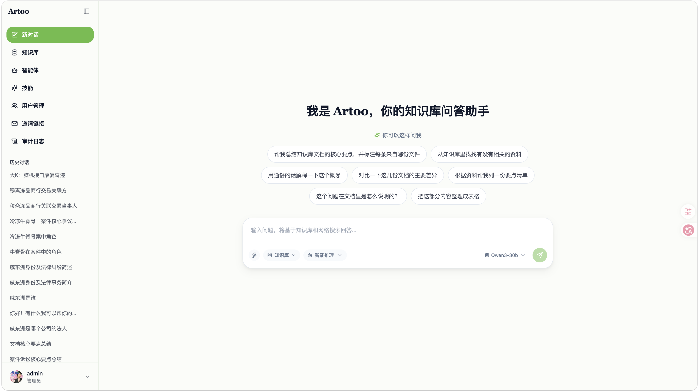

<div align="center">

# 🤖 Artoo — Let the Knowledge Base Retrieve Itself: A ReAct-Agent-Driven Agentic RAG Framework

**Open-source · LLM-powered · Self-hostable intelligent knowledge base**

Built around a ReAct Agent, Artoo lets the LLM autonomously orchestrate keyword search, semantic retrieval, deep reading, web search, and MCP tools — delivering an "evidence-first, then answer" traceable Q&A experience.

[](./LICENSE)
[](https://www.python.org/)
[](https://fastapi.tiangolo.com/)
[](https://react.dev/)
[](https://milvus.io/)

| [简体中文](./README.md) | **English** |

</div>

<p align="center">
  <a href="#-overview">Overview</a> •
  <a href="#%EF%B8%8F-architecture">Architecture</a> •
  <a href="#-feature-overview">Features</a> •
  <a href="#-screenshots">Screenshots</a> •
  <a href="#-quick-start">Quick Start</a> •
  <a href="#-documentation">Docs</a> •
  <a href="#-developer-guide">Developer Guide</a>
</p>

---

## 📌 Overview

**Artoo** is an open-source, LLM-powered Agentic RAG knowledge base framework built for enterprise-grade document understanding and traceable Q&A.

It is organized around three core capabilities: a **ReAct Agent** that autonomously decides retrieval strategy and stopping conditions within a Think → Act → Observe loop; **three-way hybrid retrieval** that recalls in parallel via dense semantic, sparse vector, and BM25 full-text search, then produces high-quality context through RRF fusion, reranking, MMR de-duplication, and parent-chunk expansion — with an optional knowledge graph (GraphRAG) joining as a fourth route that bridges via entities to recall related content pure-vector search misses; and **structure-aware document processing** that splits by logical structure, maps parent/child chunks, and runs concurrent OCR on mixed text-and-image documents. Documents can be ingested from local multi-format uploads as well as from pasted web / WeChat article links, whose main text is fetched and saved into the knowledge base in one click. Combined with visual multi-model management, hot-swappable Embedding / Rerank / OCR services, MCP tool integration, Agent Skills, and three-tier progressive context management, Artoo turns scattered documents into a queryable, reasoning-capable, traceable knowledge asset.

All AI inference (LLM / Embedding / Rerank / OCR) runs through HTTP calls to external services, keeping the backend lightweight and easy to self-host offline with full data sovereignty. The agent's reasoning is streamed to the frontend in real time via an EventBus — thoughts, tool calls, citations, and context token usage are all observable.

## ✨ Highlights

- **A real ReAct Agent** — the LLM autonomously calls tools, analyzes results, and decides whether to keep searching or submit an answer via function calling, rather than a fixed orchestration pipeline.
- **Evidence-First discipline** — a built-in Progressive RAG system prompt (Assess-Reconnaissance-Plan-Execute workflow) enforces "search first, deep-read chunks, then answer" — no fabrication from parametric memory.
- **Three-way hybrid retrieval + optional graph augmentation** — Dense + Sparse + BM25 parallel recall, with RRF fusion + reranking + composite scoring + MMR de-duplication + parent-chunk expansion; when the knowledge graph is enabled, GraphRAG joins RRF as a fourth route, recalling related content via entity bridging, with interactive force-directed graph browsing.
- **Multi-source ingestion** — beyond local multi-format uploads, paste a web / WeChat article link to fetch its main text and save it as a KB document, with the source URL retained for traceability.
- **Three-tier progressive context management** — BPE token estimation + API usage delta tracking + LLM summary consolidation + group-based truncation fallback keep long conversations within the window.
- **Extensible tool ecosystem** — built-in knowledge search, keyword matching, deep reading, attachment reading, web search, thinking, and skill loading tools, plus remote MCP Server integration.
- **Multi-tenancy & access governance** — RBAC with fixed roles (admin / member) + ownership axis, private / organization-visible knowledge bases plus point-to-point sharing, super admin, invite-based registration, audit logs, and three API-key credential models.
- **Fully observable** — agent thoughts, tool calls, citation tracing, and token usage are streamed via SSE and rendered token-by-token in the UI.

## 🏗️ Architecture

```
┌─────────────────────────────────────────────────────────────┐
│                        Access Layer                          │
│   Chat API (OpenAI-compatible · SSE)  │  Admin API (REST)    │
│   MCP Server (exposes KB capabilities)                       │
├─────────────────────────────────────────────────────────────┤
│                      ReAct Agent Engine                      │
│   Think(stream LLM) → Analyze(stop) → Act(tools) → Observe   │
│   EventBus  │  3-tier context management  │  Skills          │
├─────────────────────────────────────────────────────────────┤
│                          Tool Layer                          │
│  knowledge_search │ grep_chunks │ list_knowledge_chunks      │
│  read_attachment │ read_skill │ thinking │ web_search        │
│  final_answer │ MCP Tools                                    │
├─────────────────────────────────────────────────────────────┤
│                      Retrieval Tool Layer                    │
│  Dense + Sparse + BM25 (+ Graph) → RRF → Rerank → MMR → expand│
├─────────────────────────────────────────────────────────────┤
│                     Index / Storage Layer                    │
│   Milvus (dense + sparse vectors)  │  PostgreSQL (metadata)  │
│   Neo4j (knowledge graph, optional)                          │
├─────────────────────────────────────────────────────────────┤
│                     Data Processing Layer                    │
│   Loader → OCR → Chunker → Embedder → Indexer                │
│   Worker (Redis Stream consumer, async processing)           │
├─────────────────────────────────────────────────────────────┤
│                 Model Service Layer (external HTTP)          │
│   LLM API  │  Embedding API  │  Rerank API  │  OCR API       │
└─────────────────────────────────────────────────────────────┘
```

Fully modular from parsing, vectorization, and retrieval to LLM inference — every component is swappable. Supports local / private-cloud deployment with full data sovereignty and a zero-barrier Web UI.

## 🧩 Feature Overview

**Intelligent Conversation**

| Capability | Details |
|------------|---------|
| ReAct Reasoning | The LLM decides autonomously within a Think → Act → Observe loop: call tools, analyze results, decide when to stop |
| Tool Calling | Built-in knowledge search, keyword matching, deep reading, attachment reading, web search, thinking, skill loading; remote MCP tools |
| Evidence-First | Progressive RAG prompt enforces "search, deep-read chunks, then answer" with inline citations and no fabrication |
| Agent Presets | Built-in "Quick Q&A" (single-pass hybrid) and "Smart Reasoning" (multi-step agent); prompts editable via AI rewrite |
| Session Attachments | Files uploaded mid-conversation are indexed instantly as session-level retrieval sources; the agent reads them whole and deterministically via `read_attachment`, without competing for ranking against the formal KB |
| Context Management | Three-tier progressive compression (token estimation + usage tracking + LLM summary + group truncation) |
| Streaming Visibility | Thoughts, tool calls, citations, and token usage streamed via SSE and rendered token-by-token |

**Knowledge Management**

| Capability | Details |
|------------|---------|
| Document Formats | PDF / Word / Excel / PPT / TXT / Markdown / images / audio |
| Link Import | Paste a web / WeChat article link; the backend fetches and extracts the main text as Markdown and saves it into the KB, retaining the source URL and cover image — mobile-friendly |
| Document Organization | Folder hierarchy management, rename, thumbnail preview (authenticated fetch) |
| Mixed Content | Auto-extracts embedded images, runs concurrent OCR, inserts recognized text by page position, hash-dedups |
| Structure-Aware Chunking | Splits by logical structure, protects tables as whole blocks, parent (context) / child (precise) chunk mapping |
| Three-Way Hybrid Retrieval | Dense + Sparse + BM25, RRF fusion + Rerank + MMR + parent-chunk expansion |
| Knowledge Graph (optional) | After ingestion, entities and relations are extracted asynchronously into Neo4j, joining RRF as a fourth entity-bridging route, with interactive force-directed graph browsing (overview / neighbor drill-down / type filtering / entity detail tracing); controlled by global and per-KB toggles, off by default with zero extra cost, and degrades automatically on failure without affecting the main pipeline |
| Async Pipeline | Redis Stream task queue + independent Worker, API decoupled from processing, resumable |
| Retrieval Testing | Dedicated retrieval-only page (no LLM generation) that visualizes the three-way recall / RRF / Rerank / MMR pipeline and multi-dimensional scores, built for tuning |

**Integrations & Extensions**

| Capability | Details |
|------------|---------|
| LLM | Any OpenAI-compatible API (vLLM / DeepSeek / Qwen / …) / Ollama |
| Embedding / Rerank | Any OpenAI-compatible remote service (TEI / Infinity / vLLM), hot-swappable via frontend |
| OCR | TextIn / generic external API (remote); multi-provider with default + fallback auto-switching |
| ASR | OpenAI-compatible speech recognition (/v1/audio/transcriptions); audio files auto-transcribed and indexed, multi-provider with default + fallback auto-switching |
| Vector DB | Milvus 2.4+ (dense + sparse vectors) |
| MCP | Exposes KB capabilities (MCP Server) and integrates remote MCP tools (discovery + auto-registration) |
| Skills | Progressive Disclosure loading — read full SKILL.md instructions on demand |

**Platform**

| Capability | Details |
|------------|---------|
| Deployment | Local / Docker / offline intranet (ARM64 + AMD64 image packaging) |
| Interfaces | Web UI / RESTful API / OpenAI-compatible API / MCP Server |
| Multi-Tenancy | RBAC with fixed roles (admin / member) + ownership axis; private / organization-visible KBs plus point-to-point read/write sharing; super-admin cross-tenant governance |
| Users & Registration | Invite-based (default) and self-serve registration modes, forced password change on first login, profiles / avatars, audit logs |
| Multi-Model Management | DB-persisted multiple LLM configs; create / edit / set-default / connectivity-test; dynamic switching |
| Security | JWT login + three API-key credential models (tenant / user / external-agent, SHA256 hashed, only `/v1/` paths); configurable super-admin content-visibility boundary; external MCP tool output marked untrusted |
| Graceful Degradation | Agent error → hybrid → pure retrieval; LLM down → raw retrieved text; Reranker error → RRF results |
| Observability | Agent thought / tool / token-usage SSE events; session history persists agent_steps |

## 🖼️ Screenshots

<div align="center">



<br/><br/>



<br/><br/>



</div>

## 🚀 Quick Start

### 🛠 Prerequisites

| Dependency | Version | Notes |
|-----------|---------|-------|
| Docker & Docker Compose | 20.10+ | For Milvus, PostgreSQL, Redis |
| Python | 3.12 | ⚠️ 3.13+ has compatibility issues |
| Node.js | 18+ | Frontend build |
| LLM API | - | Any OpenAI-compatible API / Ollama |
| Embedding Service | - | TEI / Infinity / vLLM (configurable after startup) |
| Rerank Service | - | Optional (retrieval works without it) |

### 📦 Installation & Launch

```bash
git clone <repo-url>
cd artoo

# Configure environment (local dev reads backend/.env)
cp backend/.env.example backend/.env
# Edit backend/.env: at minimum set JWT_SECRET (required, fail-fast if missing);
# the initial super admin SUPER_ADMIN_USERNAME / PASSWORD is auto-created on first
# startup and forced to change on first login; LLM / Embedding can be set later in the UI
```

<details open>
<summary><b>macOS / Linux</b></summary>

```bash
make infra     # 1. start infra (Milvus + PostgreSQL + Redis), ports exposed to host
make install   # 2. install deps, auto-creates .venv
make dev       # 3. start API + Worker + frontend in parallel
```

</details>

<details>
<summary><b>Windows (PowerShell) — three terminals</b></summary>

No `make` on Windows; run the steps manually (infra still via Docker):

```powershell
# 1. Start infrastructure
docker compose --profile infra up -d

# 2. Create Python env (must be 3.12) and install deps
conda create -n artoo python=3.12 -y
conda activate artoo
pip install --upgrade pip
pip install -r backend/requirements.txt
cd frontend; npm install; cd ..

# 3. Start in three terminals
# Terminal 1: API (port must be 8000 — the frontend proxy hardcodes it)
cd backend; python -m uvicorn app.main:app --reload --port 8000

# Terminal 2: Worker
cd backend; python -m app.worker_main

# Terminal 3: Frontend
cd frontend; npm run dev
```

</details>

Once started, visit **http://localhost:3000**.

> **Embedding / Rerank / LLM can all be configured after startup** via the frontend "Embedding & Rerank Config" and "Model Management" pages — changes take effect immediately, no restart needed.

### 🌐 Service URLs

| Service | URL |
|---------|-----|
| Frontend UI | `http://localhost:3000` |
| API Docs | `http://localhost:8000/docs` |
| MCP Server | `http://localhost:8000/mcp` |

### 🧭 Usage Flow

1. **Login** → sign in with the initial super-admin account (`SUPER_ADMIN_*`); a password change is forced on first login
2. **Embedding Config** → add remote Embedding service URL → test connectivity → enable
3. **Model Management** → add LLM config → test connectivity → set as default
4. **Knowledge Base** → create → upload documents → wait for the Worker to finish processing
5. **Chat** → select a knowledge base and an Agent preset → ask questions

## 🐳 Packaging & Deployment (Production / Offline Intranet)

A single unified `docker-compose.yml` (`profiles: infra / app`) plus one `.env`; both packaging and deployment go through the scripts under `deploy/`:

```bash
# ① On a networked machine, build the offline package
#    (app images + infra images + compose + .env.example)
#    macOS / Linux:
make build                  # current architecture
make build ARCH=arm64       # specific arch (amd64 | arm64)
make build-app              # app-only update package (no infra images)

#    Windows (PowerShell):
.\deploy\build.ps1                 # current architecture
.\deploy\build.ps1 -Arch arm64     # specific arch (amd64 | arm64)
.\deploy\build.ps1 -AppOnly        # app-only update package
# output always goes to dist/

# ② Copy the whole dist/ to the (Linux) server and deploy in one shot
cd dist && ./install.sh     # load images → guide .env → start infra → start app
```

On first run, `install.sh` generates `.env` from `.env.example` and prompts for the required fields (`JWT_SECRET`, `SUPER_ADMIN_*`, `LLM_*`, `EMBED_BASE_URL`, `RERANK_BASE_URL`); fill them in and run it again to bring everything up.

Manual equivalent (inside `dist/`):

```bash
docker compose -f docker-compose.yml --profile infra up -d   # start infra, wait until healthy
docker compose -f docker-compose.yml --profile app up -d     # start app
```

## 🔍 Retrieval Modes

| Mode | Flow | Use Case |
|------|------|----------|
| **direct** | Dense vector ANN retrieval | Simple queries, low latency |
| **hybrid** (Quick Q&A) | Dense + Sparse + BM25 parallel → RRF → Rerank → MMR → parent expansion (plus a Graph fourth route when the KB has the graph enabled) | General purpose |
| **agent** (Smart Reasoning) | ReAct loop: autonomous grep / semantic search / deep read / thinking / web search, iterating until it submits an answer | Complex multi-hop queries requiring synthesis |

### Agent ReAct Loop

```
User query → (if history) resolve coreferences, redact prior KB results to force fresh retrieval
  │
  └─ while not complete and iteration < max_iterations:
       ├─ Think: stream the LLM, emit THOUGHT events in real time
       ├─ Context mgmt: usage estimate → (>50%) LLM summary consolidation → (>80%) group truncation
       ├─ Analyze: decide termination
       │    ├─ final_answer tool → submit answer
       │    ├─ natural stop → nudge to call final_answer
       │    └─ stuck loop / empty response → retry or synthesize
       ├─ Act: execute tool calls (optionally in parallel), emit TOOL_CALL / TOOL_RESULT
       └─ Observe: append tool results to messages, next round
  │
  └─ Exception → degrade to the hybrid fast path
```

For details on tools, prompts, context management, and chunking, see the [Technical Architecture](./ARCHITECTURE_EN.md).

## 🔧 Tech Stack

| Component | Choice |
|-----------|--------|
| Backend | FastAPI + Uvicorn |
| Vector Database | Milvus 2.4+ |
| Relational Database | PostgreSQL 16 |
| Task Queue | Redis Stream |
| Frontend | React 18 + TypeScript + Tailwind CSS v4 |
| Document Parsing | PyMuPDF / python-docx / openpyxl / python-pptx |
| Token Estimation | tiktoken (cl100k_base) |
| LLM | Any OpenAI-compatible API / Ollama |
| Embedding / Rerank | Any OpenAI-compatible remote service |

## 📂 Project Structure

```
artoo/
├── backend/
│   ├── app/
│   │   ├── main.py              # FastAPI entry point
│   │   ├── worker_main.py       # Worker entry point
│   │   ├── config.py            # Configuration
│   │   ├── api/                 # API routes (chat / kb / document / auth / invitation / *config …)
│   │   ├── auth/                # Multi-tenant auth & RBAC (JWT / API Key / KB authz / audit)
│   │   ├── agent/               # ReAct Agent engine
│   │   │   ├── engine.py        #   Core ReAct loop
│   │   │   ├── events.py        #   EventBus
│   │   │   ├── tools/           #   Tool layer (search / deep read / attachment / web / skills / MCP …)
│   │   │   ├── memory/          #   Three-tier context management
│   │   │   ├── skills/          #   Skills (Progressive Disclosure)
│   │   │   └── prompts/         #   Progressive RAG system prompt
│   │   ├── retrieval/           # Retrieval tools (hybrid / vector / sparse / bm25 …)
│   │   ├── pipeline/            # Document processing (loader / ocr / chunker …)
│   │   ├── models/              # Model provider abstraction (LLM / Embedding / Rerank)
│   │   └── storage/             # Storage layer (Milvus / PostgreSQL)
│   ├── Dockerfile
│   └── requirements.txt
├── frontend/                    # React frontend
├── docker-compose.yml           # Unified orchestration (profiles: infra / app)
├── docker-compose.override.yml  # Local dev override (exposes infra ports)
├── deploy/                      # Offline deploy (build.sh / install.sh / milvus tuning)
├── .env.example                 # Deployment config template
└── Makefile
```

## 🛠️ Commands

```bash
make install            # Install all dependencies (auto-creates .venv)
make dev                # Start frontend + backend + Worker
make dev-backend        # API only
make dev-worker         # Worker only
make dev-frontend       # Frontend only
make infra              # Start infrastructure (Milvus + Redis + PostgreSQL)
make infra-down         # Stop infrastructure
make test               # Run backend tests
make build              # Build offline deploy package (deploy/build.sh)
make build ARCH=arm64   # Build for a specific arch (amd64 | arm64)
make build-app          # App-only update package (no infra images)
```

## 🚀 Deployment

See [Packaging & Deployment](#-packaging--deployment-production--offline-intranet) above for the full offline / intranet flow.

## 📘 Documentation

| Document | Description |
|----------|-------------|
| [Technical Architecture](./ARCHITECTURE_EN.md) | ReAct engine, tool layer, context management, chunking, OCR extension |

## 🗺️ Roadmap

- [ ] End-to-end retrieval evaluation (RAGAS, quantifying recall & generation quality)
- [ ] Chunk metadata enrichment (Enricher summaries / keywords) + filtered retrieval
- [ ] Database migration management (Alembic)
- [ ] Data-source connectors (Feishu / Notion)
- [ ] Multi-worker horizontal scaling

## 🧭 Developer Guide

Fast development mode requires no Docker rebuilds: run `make infra` for infrastructure, then `make dev-backend`, `make dev-worker`, and `make dev-frontend` separately. The backend supports `--reload` hot-reload and the frontend uses Vite hot module replacement. On Windows there is no `make` — start the three processes manually as shown under Quick Start → Windows.

## 🤝 Contributing

Issues and Pull Requests are welcome.

**Process:** Fork → Create branch → Commit changes → Open PR

## 📄 License

Released under the [MIT License](./LICENSE). You are free to use, modify, and distribute the code with proper attribution.

## 📈 Star History

<picture>
  <source media="(prefers-color-scheme: dark)" srcset="https://api.star-history.com/svg?repos=9ilfoyl3/artoo&type=Date&theme=dark" />
  <source media="(prefers-color-scheme: light)" srcset="https://api.star-history.com/svg?repos=9ilfoyl3/artoo&type=Date" />
  
</picture>
